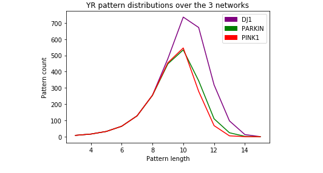

<h3 align="center">PPI ANALYSIS</h3>

Protein Protein Interaction Analysis With The Help Of Data Science And Machine Learning

# Abstract
* Protein-Protein Interaction Networks can help us to find characteristics of some diseases.
* We can apply the knowledge of the PPIs involved in the syndrome to develop any possible drugs.  **PARKIN**, **PINK1** and **DJ1** are three Hub Genes responsible for generation of some proteins which play vital roles in different cancers.
* Here in this work we try to analyze these 3 genes ( hence formed Proteins) with the help of PPI networks to find similarities or dissimilarities between them by applying Linear and Graphical Approaches.
* As a result, we may come up with some unexplored insights that can lead us towards cure to the diseases.

# Solution Approach
We are given Amino Acid (AA) sequences of hub genes and genes in networks.

    Step 1: The AA sequence is transferred into its numerical form as per the strength of the nucleotides (A=1, T=2, G=3, C=4).

    Step 2: Now, we have 64 codons in the codon table as the codon is composed of the above-mentioned ATCG. Hence the numerical representation of 64 codons can be computed from step 1. Thus, a numeric representation of each codon specifies the unique determinative degree of it.

    Step 3. 1. Represent the 64 codons of genetic code table based on the chemical classification of nucleotides i.e. purine and pyrimidine. From here we are getting those 64 codons distributed in 8 different types of patterns.

    Step 3.2: Find the percentage of each pattern contributing to code for amino acids.

    Step 4.1: To analyze given AA sequences in sequential level, we are supposed to perform the following:

        Step 4.1.1:   Read the Amino Acid sequences taken based on classification. Do multiple          
                        alignments of the given dataset using step 3.1.

        Step 4.1.2: Look for a common pattern at a common position among them    
                    and the percentage of the presence of those common patterns in        
                    sequence. This is to realize the proximity between the sequences.

    Step 5.1: To realize the proximity,
                1) the proximity between the hub gene and the other genes of the network
                2) the proximity between the genes which are common
                3) the uniqueness of the taken hub genes (eg. PARKIN, PINK1,
                        DJ1 responsible for cancer)

    Step 5.2: Now for network-level analysis, we are to conduct the following:

        Step 5.2.1: The 8 types of patterns mentioned in step 3 are considered as 
                        nodes here.

        Step 5.2.2: Construct directed multi-graph for each sequence.

        Step 5.2.3: Comparison of the directed multi-graphs constructed.

    Step 6:   Investigate evolutionary relationships among the dataset taken.

    Step 6.1: Derive Similarity/Dissimilarity Matrix of all AA Sequences taken
                based on codon classes.

    Step 6.2: Construct corresponding Phylogenetic Tree from the matrix 
                   derived.

The complete documenetation and supporting documents can be found at:
        https://drive.google.com/drive/folders/192PLOCg0HI3hU5f5FGgfTYB9smr51m1C?usp=sharing

# how to use?
Just place the `Genomics` folder under your `root` Gdrive file system and give the necessary permissions to work with the data.
